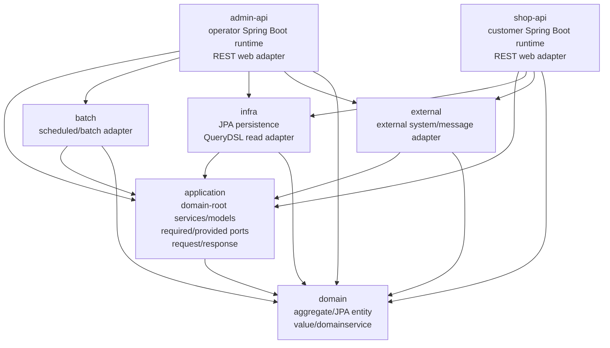
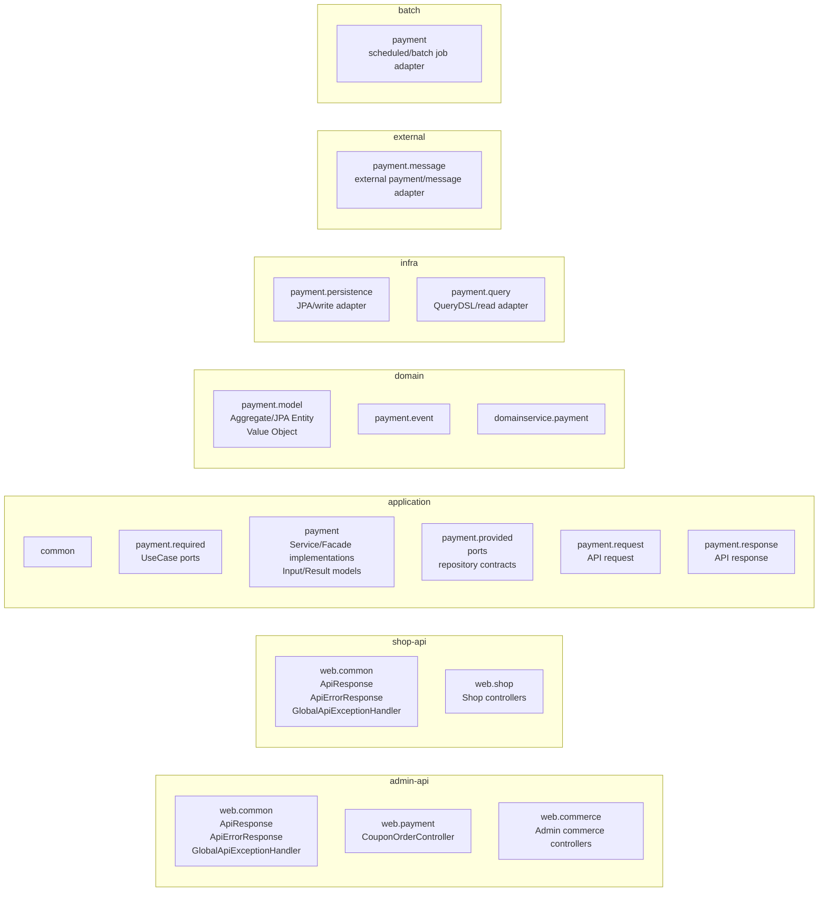
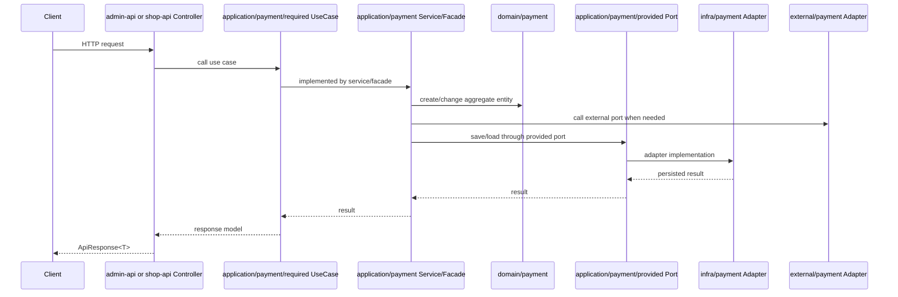
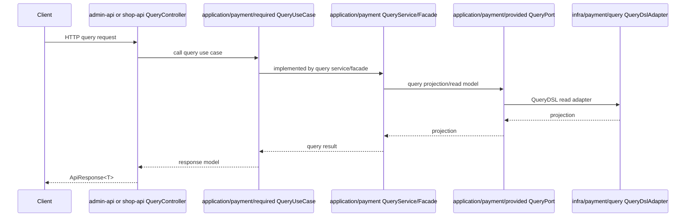
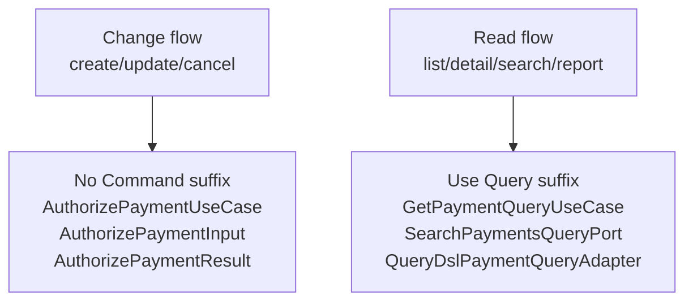

# Architecture Diagram

## Module Dependency

```mermaid
flowchart TB
    AdminApi["admin-api\noperator Spring Boot runtime\nREST web adapter"] --> Application["application\ndomain-root services/models\nrequired/provided ports\nrequest/response"]
    ShopApi["shop-api\ncustomer Spring Boot runtime\nREST web adapter"] --> Application
    AdminApi --> Batch["batch\nscheduled/batch adapter"]
    AdminApi --> Infra["infra\nJPA persistence\nQueryDSL read adapter"]
    ShopApi --> Infra
    AdminApi --> External["external\nexternal system/message adapter"]
    ShopApi --> External
    AdminApi --> Domain["domain\naggregate/JPA entity\nvalue/domainservice"]
    ShopApi --> Domain

    Batch --> Application
    Batch --> Domain

    Infra --> Application
    Infra --> Domain

    External --> Application
    External --> Domain

    Application --> Domain
```

## Package Layout

```mermaid
flowchart LR
    subgraph AdminApi["admin-api"]
        WebCommon["web.common\nApiResponse\nApiErrorResponse\nGlobalApiExceptionHandler"]
        WebPayment["web.payment\nCouponOrderController"]
        WebAdminCommerce["web.commerce\nAdmin commerce controllers"]
    end

    subgraph ShopApi["shop-api"]
        ShopCommon["web.common\nApiResponse\nApiErrorResponse\nGlobalApiExceptionHandler"]
        WebShop["web.shop\nShop controllers"]
    end

    subgraph Application["application"]
        AppCommon["common"]
        Required["payment.required\nUseCase ports"]
        Service["payment\nService/Facade implementations\nInput/Result models"]
        Provided["payment.provided\nports\nrepository contracts"]
        Request["payment.request\nAPI request"]
        Response["payment.response\nAPI response"]
    end

    subgraph Domain["domain"]
        Model["payment.model\nAggregate/JPA Entity\nValue Object"]
        Event["payment.event"]
        DomainService["domainservice.payment"]
    end

    subgraph Infra["infra"]
        Persistence["payment.persistence\nJPA/write adapter"]
        Query["payment.query\nQueryDSL/read adapter"]
    end

    subgraph External["external"]
        Message["payment.message\nexternal payment/message adapter"]
    end

    subgraph Batch["batch"]
        BatchPayment["payment\nscheduled/batch job adapter"]
    end
```

## Change Flow

```mermaid
sequenceDiagram
    participant Client
    participant Controller as admin-api or shop-api Controller
    participant Required as application/payment/required UseCase
    participant Service as application/payment Service/Facade
    participant Domain as domain/payment
    participant Provided as application/payment/provided Port
    participant Infra as infra/payment Adapter
    participant External as external/payment Adapter

    Client->>Controller: HTTP request
    Controller->>Required: call use case
    Required->>Service: implemented by service/facade
    Service->>Domain: create/change aggregate entity
    Service->>External: call external port when needed
    Service->>Provided: save/load through provided port
    Provided->>Infra: adapter implementation
    Infra-->>Provided: persisted result
    Provided-->>Service: result
    Service-->>Required: result
    Required-->>Controller: response model
    Controller-->>Client: ApiResponse<T>
```

## Query Flow

```mermaid
sequenceDiagram
    participant Client
    participant Controller as admin-api or shop-api QueryController
    participant Required as application/payment/required QueryUseCase
    participant Service as application/payment QueryService/Facade
    participant Provided as application/payment/provided QueryPort
    participant QueryDsl as infra/payment/query QueryDslAdapter

    Client->>Controller: HTTP query request
    Controller->>Required: call query use case
    Required->>Service: implemented by query service/facade
    Service->>Provided: query projection/read model
    Provided->>QueryDsl: QueryDSL read adapter
    QueryDsl-->>Provided: projection
    Provided-->>Service: projection
    Service-->>Required: query result
    Required-->>Controller: response model
    Controller-->>Client: ApiResponse<T>
```

## Naming Rule View

```mermaid
flowchart TD
    Change["Change flow\ncreate/update/cancel"] --> ChangeName["No Command suffix\nAuthorizePaymentUseCase\nAuthorizePaymentInput\nAuthorizePaymentResult"]
    Read["Read flow\nlist/detail/search/report"] --> QueryName["Use Query suffix\nGetPaymentQueryUseCase\nSearchPaymentsQueryPort\nQueryDslPaymentQueryAdapter"]
```
