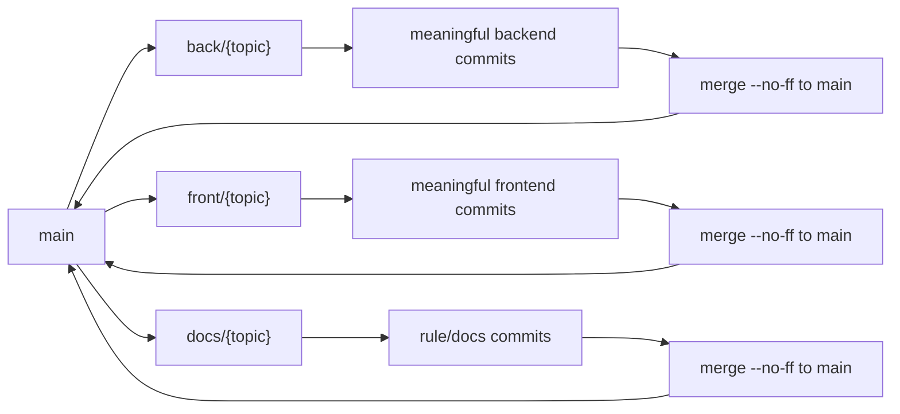

# Git Workflow

Git 규칙은 간단해야 지킬 수 있다. 이 프로젝트는 `main`을 통합 브랜치로 두고, 작업 브랜치는 역할별로 분리한다. 커밋은 저장용이 아니라 리뷰와 되돌리기가 가능한 의미 단위로 남긴다.

## Branches

작업 브랜치 prefix:

| Prefix | Purpose | Allowed paths |
|---|---|---|
| `docs/*` | 문서, 룰, workflow 정리 | `docs/**`, `workflow/**`, `rules/**` |
| `back/*` | 백엔드 구현, 테스트, backend workflow | `modules/**`, `sql/**`, `workflow/backend/**`, `rules/**`, `scripts/hooks/**` |
| `front/*` | 프론트 구현, 테스트, frontend workflow | `frontend/**`, `docs/frontend-harness/**`, `workflow/frontend/**` |
| `common/*` | 공통 도구, 루트 설정 | root config, `scripts/**`, `gradle/**`, `.githooks/**` |

규칙:

- `main`에 직접 커밋하지 않는다.
- `codex/*`, `feat/*`, `backend/*`, `frontend/*` 같은 prefix는 쓰지 않는다.
- `.githooks/pre-commit`은 브랜치 prefix와 staged path 범위를 검사한다.
- 같은 기능이면 역할별 브랜치 topic을 맞춘다.

```text
back/paginated-query-cqrs
front/paginated-query-ui
docs/commit-unit-rule
```

## Flow



같은 기능의 `back/*`와 `front/*`가 모두 있으면 보통 backend를 먼저 main에 병합하고 frontend를 나중에 병합한다. API contract가 frontend의 기준이 되기 때문이다.

## Commit Units

브랜치 안에서는 한 커밋으로 다 뭉치지 않는다. 테스트 가능하고 리뷰 가능한 의미 단위로 나눈다.

좋은 단위:

- entity/package 분리
- command/query service 분리
- port/repository 분리
- QueryDSL 조회 구현
- Spring Data `Pageable` 단순 조회 적용
- frontend API type 변경
- admin pagination UI 추가
- MSW/test fixture 변경
- 룰/문서 갱신

나쁜 단위:

- `wip`
- `temp`
- `update`
- unrelated backend + frontend + docs 한 커밋
- formatter 변경과 기능 변경을 섞은 커밋

예시:

```text
refactor: commerce entity 패키지 분리
refactor: command query service 분리
feat: QueryDSL 쿠폰 조회 pagination 적용
feat: 단순 목록 Spring Data Pageable 적용
test: CQRS 조회 규칙 검증 추가
docs: QueryDSL 조회 룰 정리
```

```text
refactor: commerce API page response 타입 적용
feat: admin 목록 pagination UI 추가
feat: shop 상품 page 응답 연결
test: MSW page 응답 fixture 적용
docs: frontend API state contract 갱신
```

작은 오타 수정이나 직전 커밋 보정은 별도 커밋으로 남기지 않고 가까운 커밋에 합친다. main merge 전에는 `wip`, `temp`, 단순 보정 커밋을 정리한다.

## Commit Message

형식:

```text
type: 한국어 요약
```

허용 type:

| Type | Use |
|---|---|
| `docs` | 문서, 룰, workflow |
| `chore` | 설정, 빌드, 도구 |
| `feat` | 사용자/운영자 기능 |
| `test` | 테스트, fixture |
| `refactor` | 동작 변경 없는 구조 개선 |
| `fix` | 버그 수정 |
| `perf` | 성능 개선 |

규칙:

- 제목은 짧게 쓴다.
- 기본은 한국어다.
- `Spring Data`, `QueryDSL`, `API`, `MSW`, `Testcontainers` 같은 기술명은 영어로 써도 된다.
- 한 커밋에는 하나의 의도만 담는다.
- 긴 설명과 검증 상세는 Git 본문보다 작업 기록에 남긴다.

## Merge To Main

main 병합 전:

- 워크트리가 clean인지 확인한다.
- 해당 브랜치에 맞는 테스트나 빌드를 실행한다.
- 커밋이 의미 단위로 나뉘었는지 확인한다.
- `wip`, `temp`, 단순 보정 커밋을 정리한다.
- `git merge --no-ff {branch}`로 main에 병합한다.
- 병합 후 smoke validation을 실행한다.

## Checklist

- [ ] 브랜치 prefix가 작업 역할과 맞다.
- [ ] staged path가 branch path rule을 지킨다.
- [ ] 커밋이 리뷰 가능한 의미 단위로 나뉘었다.
- [ ] backend와 frontend 변경을 한 브랜치에 섞지 않았다.
- [ ] main merge 전 잡음 커밋을 정리했다.
- [ ] 관련 테스트/빌드/훅을 실행했다.
- [ ] 검증하지 못한 항목은 이유를 기록했다.
